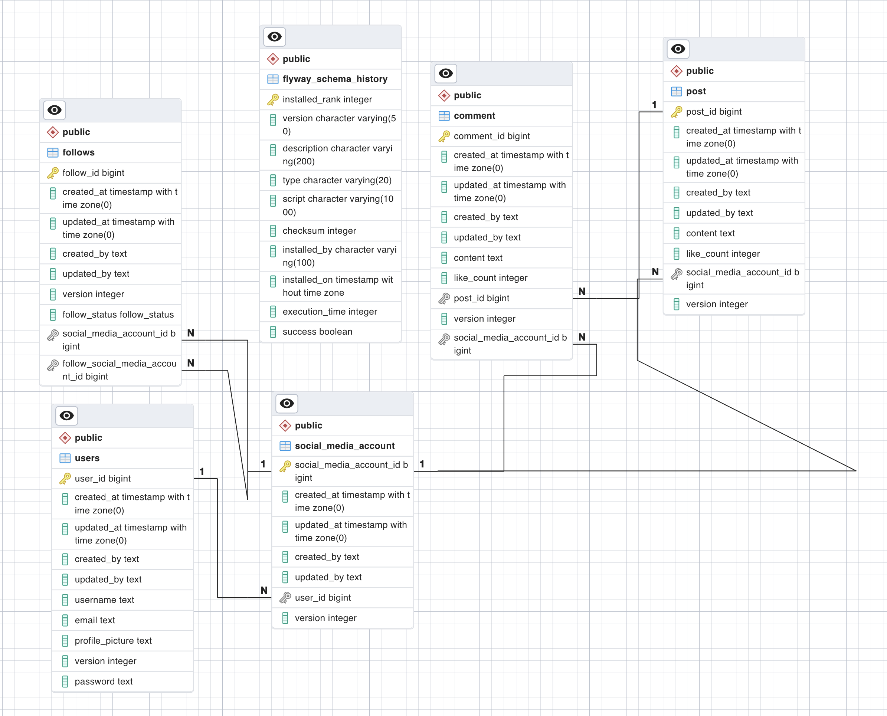

# Social Media API

A Social Web API that simulates the day-to-day operations of a social media.

## Authors

- [@olasoj](https://www.github.com/olasoj)

## 🚀 About Me

Olasoji Ige works at Paga as a software engineer. He holds a Bachelor of Science in Computer Science from Babcock University and has worked in enterprise software development for over three years. He began his career in investment and business analytics before transitioning to payments. His background in large-scale system design and implementation has given him a mature and realistic perspective on enterprise software solutions.
## Features

**The following functionalities are available in this application:**

- Users can read post/comment list without authentication.

- Users can sign up to create post/comment.

- Users can log in to create a post/comment.

- Users can log in to edit a post/comment if they are the authors of the post/comment.

- Users can create an account and receive a unique account id after signing up. When registering, the user must provide a username and email that does not already exist on the platform.

- The username and password are used to authenticate the user, which results in the user receiving an access token if successful.

- Except for reading post(s) comment(s), login and registration, every request must have a valid access token.

- This system was built using the spring-boot framework with spring security, without Postgres database, and following the best principles in software engineering.

## Environment Variables

This project made no use of environmental variables.

## Run Locally

Clone the project

```bash
   git clone -b main https://github.com/olasoj/social-media-app.git
```

Go to the project directory

```bash
  cd social-media-app
```

Start the social-media-app

```bash
   docker-compose up -d --build
```

## Documentation

[Documentation](https://documenter.getpostman.com/view/7357801/2s9YJhvKRL)

## Tech Stack

**Client:** Postman

**Server:** Java, Spring boot

**Server:** Postgres
